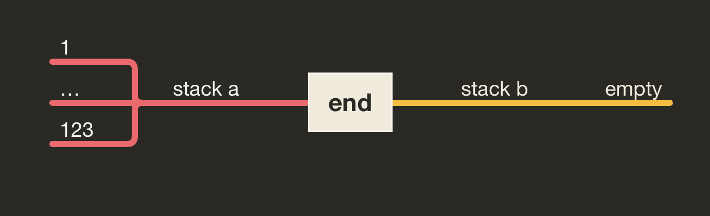

# Push_swap

## Introduction

Push_swap is a project in the algorithms branch of [Hive Helsinki](https://www.hive.fi/en/). It's object is to write a sorting algorithm which sorts a set of integers as efficiently as possible. The twist is that there are rules limiting how memory can be used and how data can be manipulated, which renders most standard sorting algorithms invalid for this task, and forces the programmer to be creative when solving this problem. Below is a summary of these rules and the game logic followed by a description of my solution to the problem. The full assignment pdf can be found [here](https://github.com/matiasjokela/Push_Swap/blob/master/push_swap.en.pdf)

## The rules

The game is composed of two stacks named a and b. At the start of the game all numbers are in stack a in a random order and stack b is empty. Duplicate numbers are not allowed. You can only manipulate the stacks using the commands in the table below. The goal is to sort all the numbers in ascending order to stack a using as few commands as possible.

| Command | Description |
| :------:| :----------:|
| sa | swap a - swap the first 2 elements at the top of stack a. Do nothing if there is only one or no elements. |
| sb | swap b - swap the first 2 elements at the top of stack b. Do nothing if there is only one or no elements. |
| ss | sa and sb at the same time. |
| pa | push a - take the first element at the top of b and put it at the top of a. Do nothing if b is empty. |
| pb | push b - take the first element at the top of a and put it at the top of b. Do nothing if a is empty. |
| ra | rotate a - shift up all elements of stack a by 1. The first element becomes the last one. |
| rb | rotate b - shift up all elements of stack b by 1. The first element becomes the last one. |
| rr | ra and rb at the same time. |
| rra | reverse rotate a - shift down all elements of stack a by 1. The last element becomes the first one. |
| rrb | reverse rotate b - shift down all elements of stack b by 1. The last element becomes the first one. |
| rrr | rra and rrb at the same time. |

The project requires you to write two separate programs called push_swap and checker. Both programs receive the initial set of numbers as command line arguments, and both programs must display an error message if the input is not valid (duplicate numbers, non-numeric input etc.).

Push_swap is the program that does the heavy lifting. It's job sort the numbers received using the available commands and the two stacks a and b. It must print the commands it uses to stdout, the fewer commands needed the better.

Checker is a validator program for push_swap and it's job is simply to check that the set of instructions push_swap generates actually results in a properly sorted stack. It does this by reading commands from stdin and applying them to the stacks. If any of the commands it receives is invalid, it must print an error message and stop. Otherwise after there are no more commands, it checks that stack b is empty and that stack a is sorted correctly. If this is the case, it prints OK, otherwise it prints KO.

### Some examples

## The algorithm

My solution to this problem is based on the idea that all numbers can first be pushed to stack b, and from there they can be pushed back to stack a one at a time in a way that results in a sorted stack a. I do this by searching for the min and max values from stack b, pushing the one that is closer, and rotating stack a if needed to keep the order correct. As such, the algorithm is not very efficient so I needed to find ways to optimize performance. The main optimization method is assigning segments to the numbers based on their relative value in the stack (e.g. segment 1 assigned for the ten smallest numbers etc.). This allows us to push the numbers to stack b in such a way that the min and max values will always be relatively close to our position in stack b once we start pushing them back to stack a, which has a significant effect in efficiency. 

A different number of segments is used based on how many numbers need to be sorted, and the algorithm is also slightly different for stacks of under 60 numbers. This is to optimize performance for all different stack sizes. Below is a more detailed explanation of the steps involved. For the sake of simplicity, the given examples will assume that we begin with stack a having the numbers 1-123 in random order and stack b being empty.

### Segments

We begin by assigning the segments. This is done by looping through stack a until all numbers have a segment assigned to them. On each iteration the smallest unassigned number is assigned. For small stacks (<60 numbers), we use six segments. Medium stacks (60-200 numbers) are divided into 12 segments and big stacks (> 200 numbers) into 32 segments. In our example, the numbers are divided in to 12 segments with numbers 1-10 getting seg 1 etc. The largest three numbers always get segment 0 for a reason we will come to later.

Having assigned the segments, it is time to push the to stack b. We iterate through stack a pushing four segments at a time starting from the middle and working our way to the edges. In our example we would first look for segments 5-8 and push when we find them. After pushing 6 or 7 we need to rotate this number to the bottom of stack b to keep the order. After this we do the same two more times to push the other segments. This way we end up with the largest and the smallest ten numbers on the to of stack b making it easier for us to find the min and max values once we start pushing them back to stack a. We leave the three largest values (segment 0) to stack a and sort them in place using a separate sort_three algorithm.

In the case of small stacks it is not optimal to use up so many moves looping through stack a to use segments in this way since any number will be relatively close in stack b anyway. In these cases we pay no attention to the segments and only loop through stack a once pushing everything but the largest three numbers to stack b.

### Minimax

Once this setup is in place, all that is left to do is to push the numbers back to stack a in the correct order.

The algorithm works by finding the min and max values from stack b and calculating the shortest distance to both from the current position. It then chooses the one that is closer and starts rotating the stack towards it. As an added optimization, the second lowest and highest numbers are also recorded and they are pushed if they are found on the way to the lowest or highest number. If only the highest number was pushed, then nothing needs to be done to stack a at this point. Otherwise stack a is rotated or its first two values swapped so that the previously pushed highest number is on top and the numbers are in the correct order. This process is repeated until stack b is empty, after which stack a needs to be rotated until the smallest number is on top, and the sorting is done.

Once again, sorting for small stacks works slightly differently to what is described above. For small stacks, it is sufficient to simply always push the highest number from stack b to stack a in each iteration. 

## Conclusion

